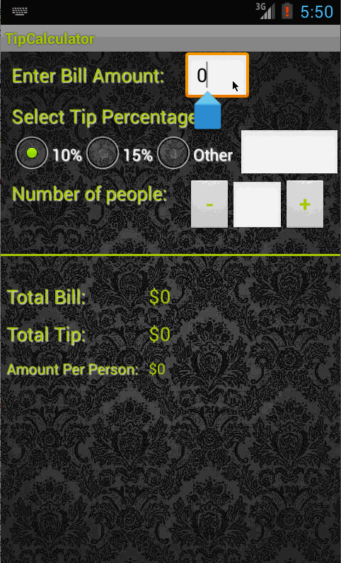

TipCalculator
=============

Codepath assignment  - Tip Calculator app

This is an app to calculate tip based on amount billed. 
User can enter the amount billed and tip percent user wants to pay, and the app shows
the total amount the user will need to pay and the tip amount.
Additionally the user can split the amount with his peers by specifying how many
ways to split it and the app will display the total amount per person.

Time Spent : 20 hrs

* [x] Required : User is displayed the tip of specified percentage for specified entered amount
* [x] Required : User enters the total amount of the transaction
* [x] Required : User can select between tip amounts (i.e 10%, 15%, 20%)
* [x] Required : Upon selecting tip amount, formatted tip value is displayed
* [x] Optional : User changes the total amount and updated tip is reflected automatically
* [x] Optional : User can select custom tip percentage if desired
* [x] Optional : User can select how many ways to split the tip
* [x] Optional : User can edit preset tip percentages and have them persist across launches - AutocompleteTextView
* [x] Optional : Experiment with trying input widgets to replace the buttons and/or textviews - Used custom view to increment/decrement num ways to split.
* [x] Optional : Improve the user interface and experience by using images and/or colors - Background image, font colors and shadows, Theme and custom styles.

Walkthrough of all user stories:

